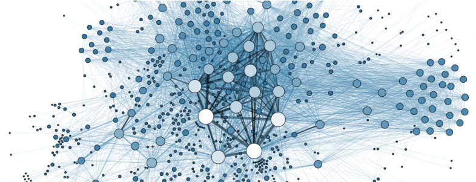
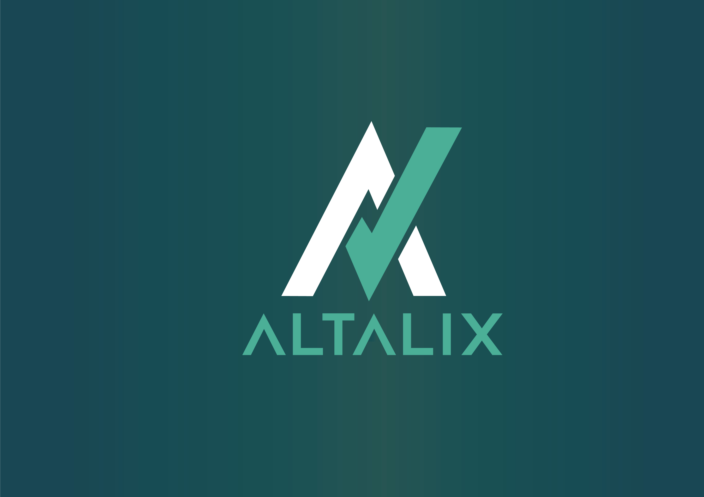
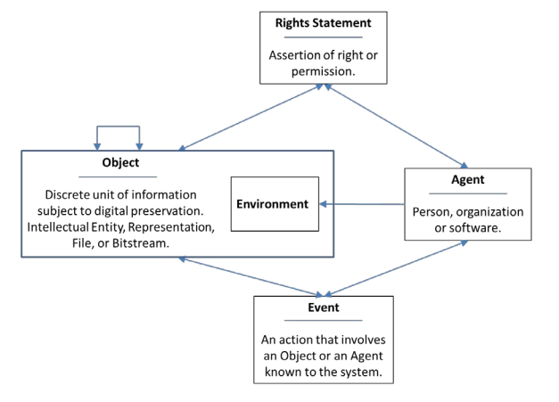
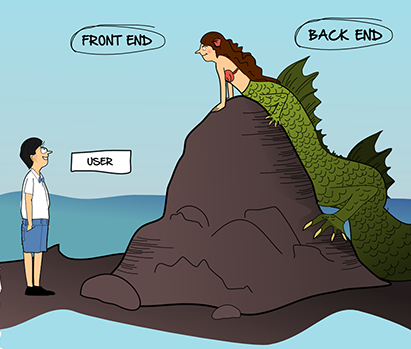
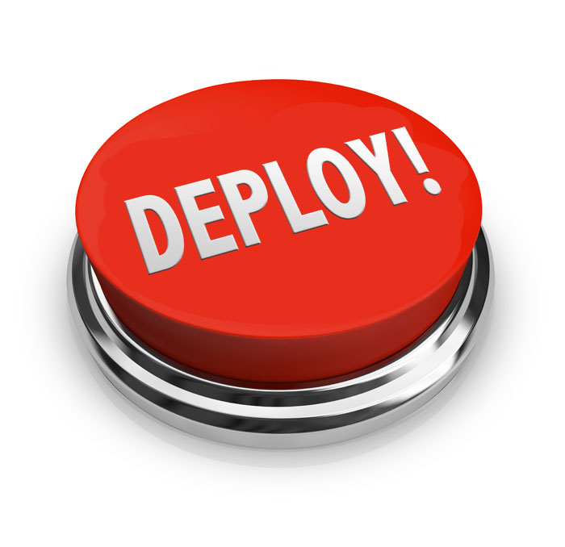
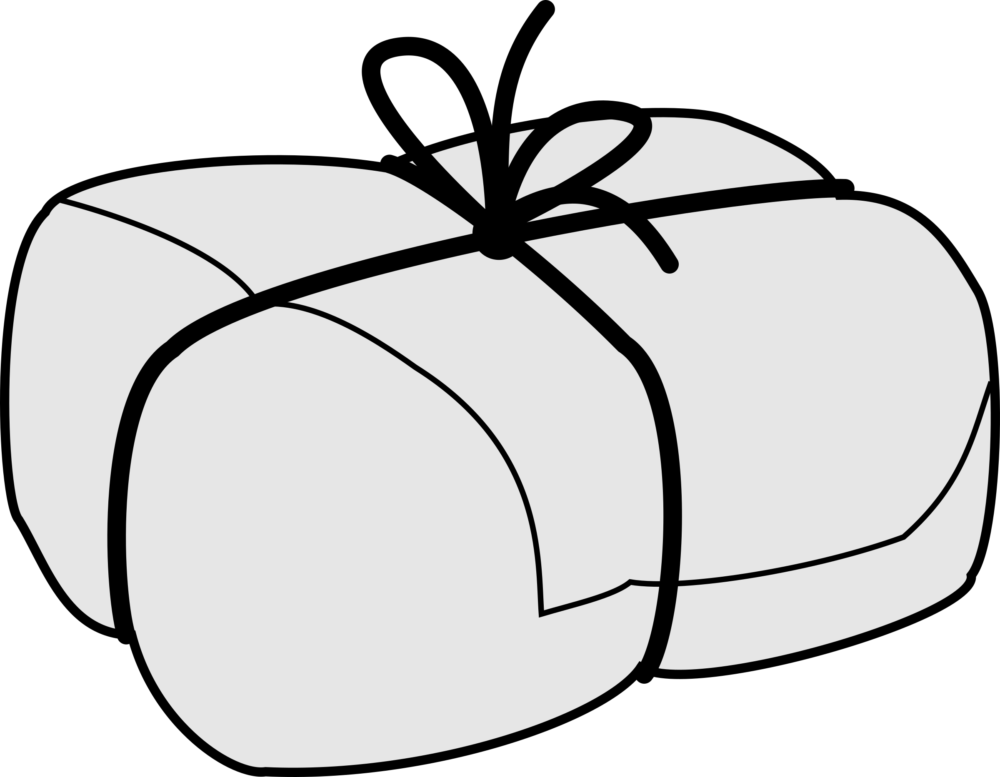

# An Introduction to Blockchain Distributed Application (dApp) Development



_Source: [Bitnation](https://tinyurl.com/nktt7tx)_

- - -

## Overview

> + Your peers
> + Introduction to [Provenator](https://github.com/glowkeeper/Provenator)
> + The dApp development ecosystem
> + The constituent parts of a dApp
> + Deploying the dApp
> + Future work (on [Provenator](https://github.com/glowkeeper/Provenator))

# Your Peers


_Source: [Forbes](https://tinyurl.com/y77aju68)_

- - -

## Me - Steven Huckle

+ 25+ years in IT
+ Trainee Cobol Programmer
+ BSc Computer Science
+ Unix Sys' Admin'
    - Reuters
    - Credit Suisse

## Me (cont'd)

+ MSc Music Technology
+ Audio Programmer in Games
    - Sony
    - Zoe Mode (here in Brighton)
+ MSc Energy and the Environment
    - Bitcoin Mining
    - PhD in Blockchain Technologies

## University of Sussex


## Publications

+ [Fake News - a Technological Approach to Proving Provenance Using Blockchains](https://doi.org/10.1089/big.2017.0071)
+ [Towards a post-cash society: An application to convert fiat money into a cryptocurrency](http://dx.doi.org/10.5210/fm.v22i3.7410)
    - [Micromorpher](https://github.com/glowkeeper/Micromorpher)
+ [Socialism and the Blockchain](http://dx.doi.org/10.3390/fi8040049)
+ [Internet of Things, Blockchain and Shared Economy Applications](http://dx.doi.org/10.1016/j.procs.2016.09.074)

## Current work

**The Value of Bitcoin**:

_Blockchain technology's value lies elsewhere from (Bitcoin's) price. Instead, it lies in the technology's flat, open, P2P topology and its demonstration of the digital commons, which creates socially egalitarian goods and services._

## Altalix



## You


_Source: [Open Clipart](https://tinyurl.com/y7l7qvk7)_

# Introduction to Provenator


_Source: [Open Clipart](https://tinyurl.com/yctu3ssl)_

- - -

## Fake News

[Provenator](https://github.com/glowkeeper/Provenator) is the result of an academic paper that was published recently in a Special Issue of a Mary-Ann Liebert journal, Big Data: [Fake News - a Technological Approach to Proving Provenance Using Blockchains](https://doi.org/10.1089/big.2017.0071).

## Blockchains

+ Blockchains are, essentially, an immutable database technology with inbuilt trust mechanisms
+ That database is comprised of a ledger, in the form of a chain of transactions
+ Included are cryptographic algorithms and digital signatures that allow secure electronic collaboration, without requiring any centralised authority
+ In other words, no single entity is in control
+ Some blockchains, such as [Ethereum](https://www.ethereum.org/), have the ability to execute smart contracts, or application code. Think of them as stored procedures with row-level security

## PREMIS

PREMIS is a provenance schema which helps identify a resource. [Provenator](https://github.com/glowkeeper/Provenator) uses PREMIS metadata definitions to record the ownership of digital media items on the ([Ethereum](https://www.ethereum.org/)) blockchain, using ([Solidity](https://solidity.readthedocs.io/)) smart contracts.



_Source: [The PREMIS Data Dictionary Version 3.0](https://www.loc.gov/standards/premis/v3/premis-3-0-final.pdf)_

## REACT


_Source: [Wikimedia Commons](https://commons.wikimedia.org/wiki/File:React-icon.svg)_

## The Live dApp

[Provenator](https://gateway.ipfs.io/ipfs/QmesSUrVz4d6LyVgKx58wWTUbMq2FmnWJ96LNNKhwj95n6/#/)

# The dApp Development Ecosystem


_Source: [Berkeley Lab](https://www.energystorage.lbl.gov/battery-ecosystem/)_

- - -

## Dependant Packages

+ [node](https://nodejs.org/en/)
+ [npm](https://www.npmjs.com/)
+ [geth](https://geth.ethereum.org/downloads/)
+ [Ganache](https://github.com/trufflesuite/ganache)
+ [Truffle](https://github.com/trufflesuite/truffle)
+ [http-server](https://www.npmjs.com/package/http-server)

## An Editor

+ [Atom](https://atom.io/)
+ [browser Solidity](https://remix.ethereum.org)

## Revision Control

You are using [GitHub](https://github.com/), aren't you?

+ [SourceTree](https://www.sourcetreeapp.com/)

## GitHub Community of Practice

1. Fork [Provenator](https://github.com/glowkeeper/Provenator)
2. Clone fork to local machine
3. Check out master branch
4. Create topic branch
5. Write patches
6. Stage and Commit patches
7. Push the new branch back up to the GitHub fork
8. Send a Pull Request

## Get/Give Help

+ [StackExchange](https://stackexchange.com/)
+ [Gitter](https://gitter.im/ethereum/home)
+ Forums etc.

# The Constituent Parts of a dApp



_Source: [comic.browserling.com](https://comic.browserling.com/15)_

- - -

## dApp Overview

+ Blockchain backend smart contracts, built using [Solidity](https://solidity.readthedocs.io/)
+ A Javascript frontend, built using [React](https://reactjs.org/)
+ The glue that fits the both together - the Ethereum JavaScript API, [web3.js](https://github.com/ethereum/web3.js/)

## The Backend Blockchain

+ Smart contracts, built using [Solidity](https://solidity.readthedocs.io/)

## The Web Interface

+ A Javascript frontend, built using [React](https://reactjs.org/)
+ The Ethereum JavaScript API, [web3.js](https://github.com/ethereum/web3.js/)
+ The contract address
+ The contract ABI

## Sending/Receiving Transactions

**Asynchronous transactions**. When you call a smart contract's method, you create a blockchain transaction, and the return value will be a transaction hash, not the result from the method. That's because the method's result is only returned after the transaction has been mined. Hence, you need to _poll_ for the result, using an **async/await** pattern.

## Running the dApp

When running the dApp, [MetaMask](https://metamask.io/) stitches together the javascript frontend and the blockchain backend. It also manages your wallet, and signs the transactions created: [Using MetaMask](https://youtu.be/6Gf_kRE4MJU).

# Deploying the dApp



_Source: [abidibo.net](https://tinyurl.com/ydezua5t)_

- - -

## Deploying Locally

Run and test the dApp locally, before deploying to a public blockchain.

## Prerequisites

Download and install the dependencies (if you have not already done so):

+ [node](https://nodejs.org/en/)
+ [npm](https://www.npmjs.com/)
+ ([geth](https://geth.ethereum.org/downloads/))
+ [Ganache](https://github.com/trufflesuite/ganache)
+ [Truffle](https://github.com/trufflesuite/truffle)
+ [http-server](https://www.npmjs.com/package/http-server)
+ [Provenator](https://github.com/glowkeeper/Provenator)

## Install

Run a local Ethereum blockchain via [Ganache](https://github.com/trufflesuite/ganache):

1. Change to the [Ganache](https://github.com/trufflesuite/ganache) repository's home directory
2. Run `npm install`
3. Run `npm start`
4. Ensure [Ganache](https://github.com/trufflesuite/ganache) is running on [http://localhost:8545](http://localhost:8545) (you may need to change its settings)

## Install (cont'd)

Install the [Provenator](https://github.com/glowkeeper/Provenator) repository's dependencies:

1. Change to the [Provenator](https://github.com/glowkeeper/Provenator) repository's home directory
2. Run `npm install`

## Contract Deployment

Use [Truffle](https://github.com/trufflesuite/truffle) to publish the contracts to [Ganache](https://github.com/trufflesuite/ganache), your local blockchain instance:

1. Change to the [Provenator](https://github.com/glowkeeper/Provenator) smart contracts directory _blockchain/contracts_
2. Run `truffle migrate`

## Point the Frontend at the Smart contracts

+ Edit the [Provenator](https://github.com/glowkeeper/Provenator) source file _app/utils/contractHandler.jsx_ so that the four static variables `premisObjectContractAddress`, `premisEventContractAddress`, `premisAgentContractAddress` and `premisRightsContractAddress` contain the addresses generated by `truffle migrate`, above. e.g

````
static premisObjectContractAddress = '0xb9bfd8ff77db391a28a45b6c1cb72b0028695219'
static premisEventContractAddress = '0x12dba0b95a32239a5ba3e6bf7d05471d18f30d1f'
static premisAgentContractAddress = '0xc3a182dd01e3d9ffdbe95ce568b9c8d936e2ca9d'
static premisRightsContractAddress = '0xec6a5f11e7865aadc61f27faf8707795c1cda868'
````

## Build the Frontend

Now create the web application:

1. In the [Provenator](https://github.com/glowkeeper/Provenator) repository's home directory, build the [React](https://reactjs.org/) frontend by typing `npm run watch`
2. Copy some needed resources to the build directory by typing `npm run copy`

## Load the dApp

1. Start an instance of [http-server](https://www.npmjs.com/package/http-server) by typing `npm run start`
2. Load a [MetaMask](https://metamask.io/) enabled browser
3. Point [MetaMask](https://metamask.io/) at your local running instance of the blockchain ([http://localhost:8545](http://localhost:8545))
4. Import a wallet from [Ganache](https://github.com/trufflesuite/ganache)
5. In the browser, go to the URL [http://localhost:8081](http://localhost:8081)
6. Create a digital media resource and subsequently, get details about that resource

## Deploying Publicly

+ The test Ethereum network, [Rinkeby](https://www.rinkeby.io)
+ [IPFS](https://ipfs.io/)

## Rinkeby

Use the [geth](https://geth.ethereum.org/downloads/) client to instantiate the test Ethereum network, [Rinkeby ](https://www.rinkeby.io):

1. `geth --testnet`

## Deploy to Rinkeby

Use [Truffle](https://github.com/trufflesuite/truffle) to publish the contracts to [Rinkeby](https://www.rinkeby.io):

1. Change to the [Provenator](https://github.com/glowkeeper/Provenator) smart contracts' directory _blockchain/contracts_
2. Run `truffle migrate`.

## Point the Frontend at the Smart contracts

+ Edit the [Provenator](https://github.com/glowkeeper/Provenator) source file _app/utils/contractHandler.jsx_ so that the four static variables `premisObjectContractAddress`, `premisEventContractAddress`, `premisAgentContractAddress` and `premisRightsContractAddress` contain the addresses generated by `truffle migrate`, above. e.g

````
static premisObjectContractAddress = '0xb9bfd8ff77db391a28a45b6c1cb72b0028695219'
static premisEventContractAddress = '0x12dba0b95a32239a5ba3e6bf7d05471d18f30d1f'
static premisAgentContractAddress = '0xc3a182dd01e3d9ffdbe95ce568b9c8d936e2ca9d'
static premisRightsContractAddress = '0xec6a5f11e7865aadc61f27faf8707795c1cda868'
````

## Build the Frontend

Now create the web application:

1. In the [Provenator](https://github.com/glowkeeper/Provenator) repository's home directory, build the [React](https://reactjs.org/) frontend by typing `npm run watch`
2. Copy some needed resources to the build directory by typing `npm run copy`

## Deploy the Frontend to IPFS

[IPFS](https://ipfs.io/)

## Load the dApp

1. Fire up a [MetaMask](https://metamask.io/) enabled browser
2. Point [MetaMask](https://metamask.io/) at [Rinkeby](https://www.rinkeby.io)
3. Use the [rinkeby faucet](https://www.rinkeby.io/#faucet) to fund your wallet
4. In the browser, go to the dApp URL [the address here](http://an.ipfs.address)
5. Create a digital media resource and subsequently, get details about that resource

# Future Work on Provenator


_Source: [Open Clipart](https://tinyurl.com/yca6w2pw)_

- - -

## Research Project

Looking at acquiring funding for a research project based on the ideas presented in [Fake News - a Technological Approach to Proving Provenance Using Blockchains](https://doi.org/10.1089/big.2017.0071) and [Provenator](https://github.com/glowkeeper/Provenator).

## Some Other Ideas

+ UI improvements
+ Search, via perceptual hashes?
+ [Dat](https://github.com/datproject) rather than [IPFS](https://ipfs.io/)?
+ A mobile app'

## Your Input

How do you think [Provenator](https://github.com/glowkeeper/Provenator) can be improved?

# Wrapping Up



_Source: [Open Clipart](https://openclipart.org/detail/220024/parcel-bw)_

- - -

## Session overview

> + [Provenator](https://github.com/glowkeeper/Provenator)
> + The dApp development ecosystem
> + The constituent parts of a dApp
> + Deploying the dApp
> + Future work (on [Provenator](https://github.com/glowkeeper/Provenator))

## Get Involved!

[Provenator](https://github.com/glowkeeper/Provenator) is an open source, free software project on GitHub...

## Presentation

Additionally, this presentation is now **public**, and available on [GitHub](https://github.com/glowkeeper/dApp-Development).

# Thank You


_Source: [BBC Sport](http://www.bbc.co.uk/sport/football/30808244)_

- - -
